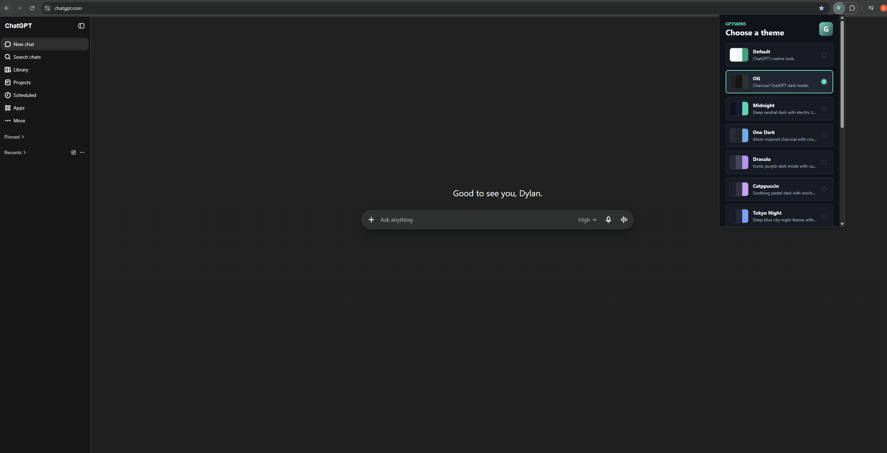
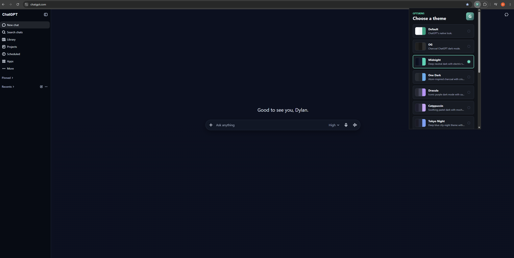
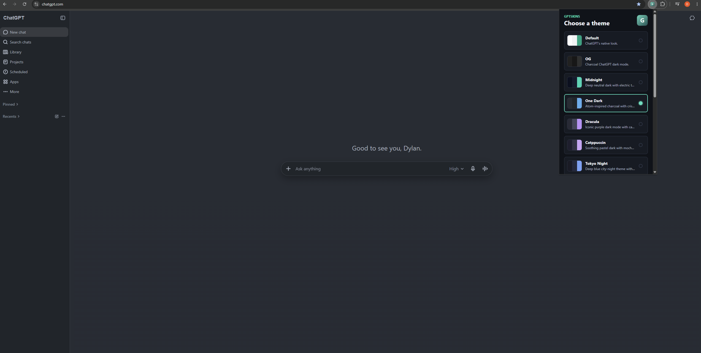
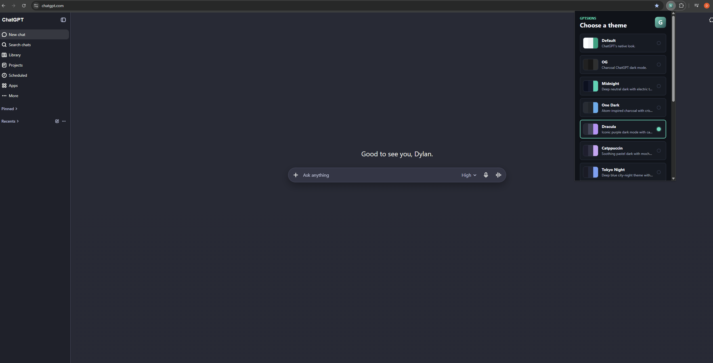

# GPTskins

GPTskins is a completely free, open source, and dependency-free Manifest V3 browser extension that adds 34 custom themes and simple font switching to ChatGPT.

Switch ChatGPT into popular editor-inspired themes like Catppuccin Latte, GitHub Dark, Tokyo Day, and Xcode Dark, or choose a different local font style.

## Preview

<table>
  <tr>
    <td><strong>OG</strong><br></td>
    <td><strong>Midnight</strong><br></td>
  </tr>
  <tr>
    <td><strong>One Dark</strong><br></td>
    <td><strong>Dracula</strong><br></td>
  </tr>
</table>

## Features

- Popup-only style picker with Theme and Font panels.
- Adds 34 custom themes while preserving ChatGPT's Default look.
- Built-in themes: Default, OG, Absolutely, Ayu, Ayu Light, Catppuccin, Catppuccin Latte, Codex, Dracula, Everforest, Forest, Everforest Light, Gruvbox, Gruvbox Light, GitHub Dark, Linear, Lobster, Material, Matrix, Monokai, Night Owl, Nord, One, Oscurange, Raycast, Rose Pine, Rose, Rose Pine Dawn, Sentry, Solarized, Solar, Temple, Tokyo Night, Tokyo Day, and Xcode Dark.
- Built-in fonts: Default, Verdana, Georgia, and Mono.
- Saved selection with `chrome.storage.sync`.
- Automatic theme and font loading on `chatgpt.com` and `chat.openai.com`.
- No backend, login, external API, or build step.

## Available Themes

- OG
- Absolutely
- Ayu
- Ayu Light
- Catppuccin
- Catppuccin Latte
- Codex
- Dracula
- Everforest
- Forest
- Everforest Light
- Gruvbox
- Gruvbox Light
- GitHub Dark
- Linear
- Lobster
- Material
- Matrix
- Monokai
- Night Owl
- Nord
- One
- Oscurange
- Raycast
- Rose Pine
- Rose
- Rose Pine Dawn
- Sentry
- Solarized
- Solar
- Temple
- Tokyo Night
- Tokyo Day
- Xcode Dark

## Available Fonts

- Default
- Verdana
- Georgia
- Mono

## Load in Chrome or Edge

1. Clone or download the extension to a folder on your computer.

   ```
   git clone https://github.com/dboyza/GPTskins.git
   ```

   You can also use GitHub's **Code** > **Download ZIP** option and unzip it anywhere you like.
2. Open `chrome://extensions` or `edge://extensions`.
3. Enable **Developer mode**.
4. Choose **Load unpacked**.
5. Select the folder you cloned or unzipped.
6. Open ChatGPT, click the GPTskins toolbar icon, and pick a theme or font.

## Project Layout

- `manifest.json` defines the Manifest V3 extension.
- `shared/themes.js` contains the built-in theme and font definitions.
- `content/content.js` applies the selected theme and font on ChatGPT pages.
- `popup/` contains the extension popup UI.
- `icons/` contains generated extension icons.
