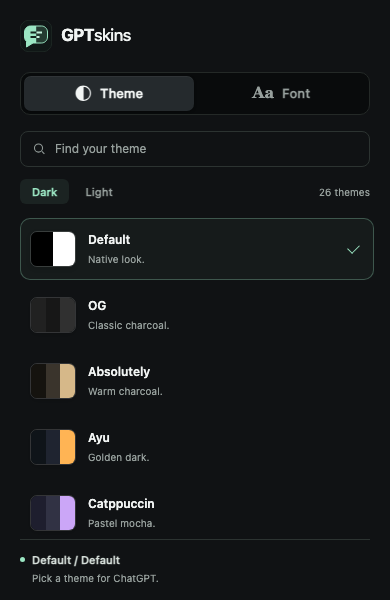
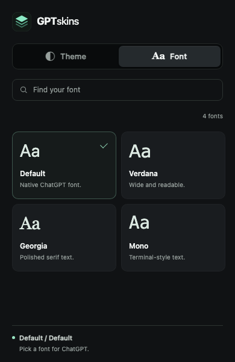
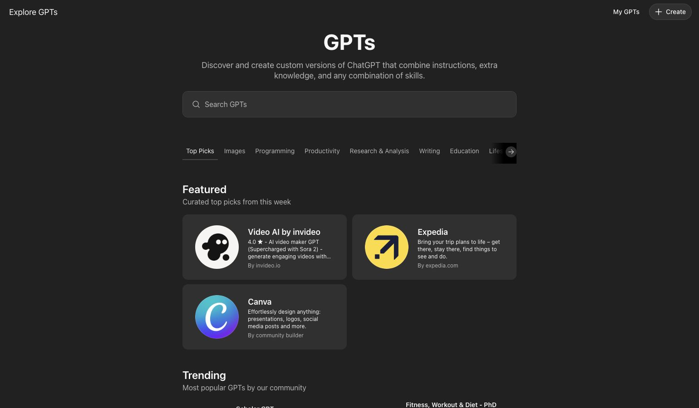

<p align="center">
  
</p>
<h1 align="center">GPTskins</h1>
<p align="center"><strong>A new look for ChatGPT.</strong><br>Editor-inspired themes and fonts, one click away.</p>
<p align="center">
  <a href="#install">Install</a> ·
  <a href="#preview">Preview</a> ·
  <a href="docs/testing.md">Testing guide</a> ·
  <a href="docs/releasing.md">Release guide</a> ·
  <a href="PRIVACY.md">Privacy</a> ·
  <a href="https://github.com/dboyza/GPTskins/issues">Report an issue</a>
</p>
<p align="center"><strong>34 themes</strong> &nbsp; / &nbsp; <strong>7 font choices</strong> &nbsp; / &nbsp; <strong>No build step</strong></p>

## Install

For Chrome or Edge:

```sh
git clone https://github.com/dboyza/GPTskins.git
```

Or use **Code → Download ZIP** above and extract it.

1. Open `chrome://extensions` or `edge://extensions` and enable **Developer mode**.
2. Click **Load unpacked** and select the `GPTskins` folder containing `manifest.json`.
3. Open [ChatGPT](https://chatgpt.com), pin GPTskins from the browser's extensions menu, and click its icon.
4. Pick a theme or font to see it applied immediately.

No Node.js, separate extension account, or build command is needed to install the extension.
After updating the files, reload GPTskins on the extensions page and refresh ChatGPT.

## Preview

Click a thumbnail to view it at full size.

<table>
  <tr>
    <td align="center"><a href="docs/screenshots/theme-picker.png"></a><br><strong>Find your theme</strong></td>
    <td align="center"><a href="docs/screenshots/font-picker.png"></a><br><strong>Choose your type</strong></td>
  </tr>
</table>

<a href="docs/screenshots/og-explore.png"></a>

*OG on ChatGPT.*

## Make it your own

- **Dark or light.** Choose from 34 palettes, including Catppuccin, GitHub Dark, Nord, Rose Pine, and Tokyo Night.
- **Search and switch.** Filter the picker by name or description, then apply a style without leaving your chat.
- **Mix theme and font.** Try JetBrains Mono, Fira Code, or Space Mono, alongside Default, Verdana, Georgia, and Mono.
  The three coding fonts are bundled and work without installing fonts or contacting a font service.
- **Keep your preferences.** Choices are saved through browser sync storage and restored when ChatGPT loads.
- **Return to native.** Select Default to remove custom colors; reset the font separately.

GPTskins is a free Manifest V3 extension with no backend, external API, or runtime dependencies.
It runs on `chatgpt.com` and `chat.openai.com`.
Bundled fonts are distributed under the SIL Open Font License; see [font sources and licenses](fonts/README.md).

## Development

With Node.js 22 or newer, run from the repository root:

```sh
npm ci
npx playwright install chromium
npm test
```

Use `npm run test:full` to include screenshot comparisons; the checked-in baselines are for macOS.
See the [testing guide](docs/testing.md) for platform setup, reports, and baseline review.

Spotted a regression after a ChatGPT update?
[Open an issue](https://github.com/dboyza/GPTskins/issues) with the theme, affected screen, and a screenshot with private content removed.
The [live audit workflow](docs/live-audit.md) explains how to reproduce it and add lasting regression coverage.
